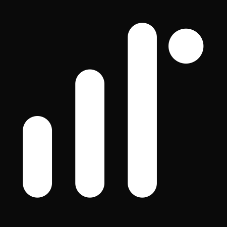

<div align="center">
  
  
  # Kine UI
  ### Native Spatial Computing for the DOM

  [](https://github.com/open-dev-society/kine-ui/stargazers)
  [](LICENSE)
  [](https://nextjs.org)
  [](https://tailwindcss.com)

  **Standardizing hand-gesture interaction for React.**  
  Kine UI provides high-performance, copy-pasteable spatial primitives powered by MediaPipe WebAssembly. 100% Client-Side. Zero Latency.
</div>

---

> [!IMPORTANT]
> **Project Banner © Open Dev Society.** This project is licensed under AGPL-3.0; if you modify, redistribute, or deploy it (including as a web service), you must release your source code under the same license and credit the original authors.

**Kine UI** is an open-source alternative to heavy, black-box computer vision libraries. Build spatial interfaces, track real-time gestures, and explore native spatial computing — built openly, for everyone, forever free.

> [!NOTE]
> Kine UI is community-built and utilizes `@mediapipe/tasks-vision` for client-side processing. Detection quality may vary based on lighting and hardware configuration. Nothing here is intended for critical safety systems.

---

## 📋 Table of Contents
- [✨ Introduction](#-introduction)
- [🌍 Open Dev Society Manifesto](#-open-dev-society-manifesto)
- [⚙️ Tech Stack](#-tech-stack)
- [🔋 Features](#-features)
- [🤸 Quick Start](#-quick-start)
- [🧱 Project Structure](#-project-structure)
- [📡 Data & Integrations](#-data--integrations)
- [🧪 Scripts & Tooling](#-scripts--tooling)
- [🤝 Contributing](#-contributing)
- [🛡️ Security](#-security)
- [📜 License](#-license)
- [🙏 Acknowledgements](#-acknowledgements)

---

## ✨ Introduction
Kine UI is a modern spatial computing registry powered by **Next.js 15 (App Router)**, **shadcn/ui** distribution logic, **Tailwind CSS v4**, and **MediaPipe WebAssembly**. It delivers raw, editable React source code directly into your project via a dedicated CLI.

---

## � Open Dev Society Manifesto
We live in a world where knowledge is hidden behind paywalls. Where tools are locked in subscriptions. Where information is twisted by bias. Where newcomers are told they’re not “good enough” to build.

We believe there’s a better way.

**Our Belief**: Technology should belong to everyone. Knowledge should be open, free, and accessible. Communities should welcome newcomers with trust, not gatekeeping.  
**Our Mission**: Build free, open-source projects that make a real difference:
- Tools that professionals and students can use without barriers.
- Knowledge platforms where learning is free, forever.
- Communities where every beginner is guided, not judged.
- Resources that run on trust, not profit.  
**Our Promise**: We will never lock knowledge. We will never charge for access. We will never trade trust for money. We run on transparency, donations, and the strength of our community.  
**Our Call**: If you’ve ever felt you didn’t belong, struggled to find free resources, or wanted to build something meaningful — you belong here.  
*Because the future belongs to those who build it openly.*

---

## ⚙️ Tech Stack
### Core
- **Next.js 15 (App Router)** & **React 19**
- **TypeScript**
- **Tailwind CSS v4** (via @tailwindcss/postcss)
- **shadcn/ui** architecture for registry distribution
- **Lucide React** for iconography

### Spatial Engine
- **@mediapipe/tasks-vision**: Ultra-fast hand tracking via WebAssembly
- **Framer Motion**: Spring physics for jitter reduction and fluid UI updates

### Tooling
- **next-themes**: Dark mode as the primary visual state
- **clsx** & **tailwind-merge**: Dynamic class management

---

## 🔋 Features

### ☝️ Air Cursor (Pinch-to-Click)
- Maps `landmarks[8]` (Index Finger Tip) to screen coordinates.
- **Euclidean Detection**: $d = \sqrt{(x_i - x_t)^2 + (y_i - y_t)^2 + (z_i - z_t)^2}$
- Dispatches native `click` events to DOM elements under the cursor.

### ↔️ Swipe Area (Velocity Tracking)
- Tracks palm center velocity over a 5-frame rolling buffer.
- Triggers `onSwipeLeft` and `onSwipeRight` events for carousels and navigation.

### ↕️ Air Scroll (Vertical Dynamics)
- Maps hand Y-axis velocity to `window.scrollY`.
- Hands-free page navigation with momentum-based scrolling.

### 🤏 Pinch to Zoom (Spatial Scaling)
- Intuitive scaling for images, maps, and 3D scenes.
- Direct landmark distance mapping to `scale` transforms.

---

## 🤸 Quick Start

### Prerequisites
- **Node.js 20+**
- A webcam with `{ video: { facingMode: "user" } }` support
- A React-based project (Next.js 14+ recommended)

### 1. Clone or Initialize
If you are adding Kine UI to an existing project:
```bash
npx @opendevsociety/kine-ui@latest init
```

### 2. Add Your First Component
Choose a gesture from the registry and inject its source code:
```bash
npx @opendevsociety/kine-ui@latest add air-cursor
```

### 3. Mount the Provider
Wrap your application in the `KineProvider` to initialize the tracking engine singleton.
```tsx
import { KineProvider } from "@/components/kine/KineProvider";
import { AirCursor } from "@/components/kine/AirCursor";

export default function Root() {
  return (
    <KineProvider>
      <AirCursor activeColor="#10b981" />
      {/* Your App */}
    </KineProvider>
  )
}
```

---

## 🧱 Project Structure
```plaintext
kine-ui/
├── packages/
│   └── cli/                # The npx kine-ui CLI source code
├── public/
│   └── r/                  # Compiled registry JSON payloads
├── src/
│   ├── app/                # Documentation and Demo site
│   │   ├── docs/           # Documentation pages
│   │   └── api/            # API routes (stars, etc.)
│   ├── components/
│   │   └── ui/             # Site-specific UI components
│   ├── registry/           # Hand-gesture source code (THE REGISTRY)
│   │   ├── core/           # Wasm Engine (KineEngine)
│   │   └── gestures/       # React Gesture Components
│   └── registry.json       # Registry manifest for the CLI
└── scripts/                # Build and registry compilation scripts
```

---

## 📡 Data & Integrations

### MediaPipe WebAssembly
- The tracking engine runs in a dedicated WebWorker to prevent blocking the main UI thread.
- Utilizes the `hand_landmarker.task` model for 21-point tracking.

### Framer Motion
- All movements are interpolated via spring physics to handle the naturally jittery webcam data.
- Ensures a "solid" feel for the Air Cursor and UI elements.

---

## 🧪 Scripts & Tooling
- `npm run dev`: Starts the documentation site and livedemo.
- `npm run build`: Compiles the Next.js site and registry.
- `npx kine-ui`: The primary distribution tool for spatial components.

---

## 🤝 Contributing
You belong here. Whether you’re a student, a self-taught dev, or a seasoned engineer — contributions are welcome.

- Open an issue to discuss ideas and bugs.
- Look for “good first issue” or “help wanted”.
- Keep PRs focused; add screenshots for UI changes.
- **Be kind, guide beginners, no gatekeeping — that’s the ODS way.**

---

## 🛡️ Security
If you discover a vulnerability:
- Do not open a public issue.
- Email: **opendevsociety@gmail.com**
- We'll coordinate responsible disclosure and patch swiftly.

---

## 📜 License
Kine UI is and will remain free and open for everyone. This project is licensed under the **AGPL-3.0 License** - see the LICENSE file for details.

---

## 🙏 Acknowledgements
- **MediaPipe** for the incredible WebAssembly tracking engine.
- **shadcn** for the innovative registry distribution model.
- **Framer Motion** for the buttery smooth spring physics.

### Our Honourable Contributors
- **ravixalgorithm** - Lead developer of the engine and core registry.

---

<p align="center">
  Built with ❤️ by the <b>Open Dev Society</b>
</p>


---